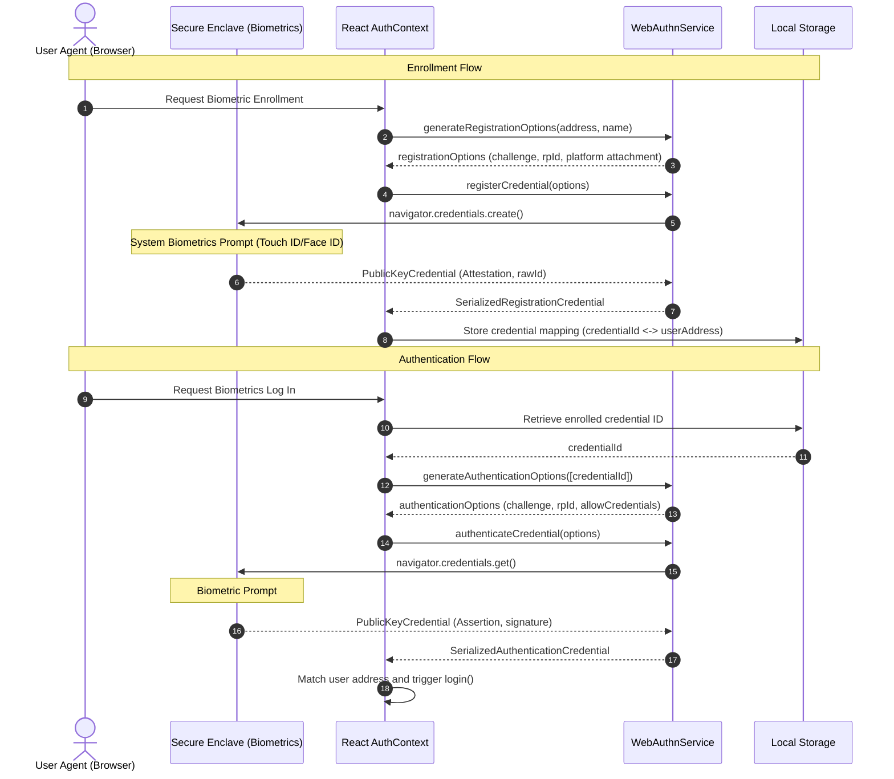

# Secure Enclave WebAuthn Integration

This document outlines the architecture, flow, error handling, and testing instructions for SoroTask's Secure Enclave WebAuthn Integration.

## Protocol Architecture

SoroTask uses the Web Authentication (WebAuthn) API to bind authentication credentials directly to hardware-backed cryptoprocessors (e.g., Apple Secure Enclave, Windows Hello, Android Keystore).



## Enforcing Hardware Protection

To guarantee that keys are generated and stored in a secure hardware token (e.g., Apple Secure Enclave) rather than roaming USB security keys, SoroTask configures the following options:

1. **`authenticatorAttachment: "platform"`**: Restricts credentials to platform authenticators built into the host machine (such as Secure Enclave or TPM).
2. **`userVerification: "required"`**: Enforces biometric verification (Touch ID/Face ID) or PIN-entry. The operation will fail if the user fails or skips verification.
3. **Algorithm Parameters**: Prioritizes `alg: -7` (ES256 - ECDSA using P-256 and SHA-256), which is universally supported by Secure Enclave devices.

## Fallback Logic & Graceful Degradation

If WebAuthn is unsupported or biometric checks fail:
1. **Compatibility Check**: On login portal load, `isSupported()` and `isPlatformAuthenticatorAvailable()` are evaluated.
2. **Graceful UI Adaption**:
   - If biometrics are not configured or unsupported, the "Sign in with Biometrics" button is hidden.
   - The user is seamlessly offered the standard mock Stellar address selection (or browser wallet signing flow in production).
3. **Enrollment Path**: Users can register their biometrics dynamically while logged in with their standard key, enabling biometrics for future sessions.

## Error Tracking & Telemetry

Errors during WebAuthn interactions are captured, categorized, and forwarded to Sentry error tracking:

| DOMException Name | Translated UI Message | Sentry Tag / Action |
| :--- | :--- | :--- |
| `NotAllowedError` | Authentication cancelled or biometric verification rejected. | `{ action: "enroll/authenticate", type: "webauthn_error" }` |
| `SecurityError` | Origin or security verification failed. Please try again on a secure connection. | `{ action: "enroll/authenticate", type: "webauthn_error" }` |
| `NotSupportedError` | Biometric or platform authenticator is not supported on this device. | `{ action: "enroll", type: "webauthn_error" }` |
| `InvalidStateError` | This device biometric key is already enrolled. | `{ action: "enroll", type: "webauthn_error" }` |
| `TimeoutError` | Biometric verification timed out. Please try again. | `{ action: "enroll/authenticate", type: "webauthn_error" }` |

## Local Testing & Mocking Guidelines

Because the physical Secure Enclave requires human biometric interaction, developers can test WebAuthn locally in the following ways:

### 1. Jest Mocks (Unit/Integration Testing)
Automated tests mock the `navigator.credentials.create` and `navigator.credentials.get` APIs directly. 
Refer to `frontend/__tests__/useWebAuthn.test.ts` for examples.

```typescript
// Example Jest Mocking
Object.defineProperty(global.navigator, 'credentials', {
  value: {
    create: jest.fn().mockResolvedValue({
      id: 'mock_credential_id',
      rawId: new Uint8Array([1, 2, 3]).buffer,
      type: 'public-key',
      response: {
        clientDataJSON: new Uint8Array([4, 5]).buffer,
        attestationObject: new Uint8Array([6, 7]).buffer,
      }
    }),
  },
  writable: true,
});
```

### 2. Chrome DevTools Virtual Authenticator
When testing in the browser locally (over `localhost` or HTTPS):
1. Open Chrome DevTools.
2. Click the three dots menu -> **More tools** -> **WebAuthn**.
3. Check **Enable Virtual Authenticator Environment**.
4. Add a virtual authenticator:
   - Protocol: `ctap2`
   - Transport: `internal` (representing platform authenticators)
   - Supports Resident Keys: Enabled
   - Supports User Verification: Enabled
5. You can now test the enrollment and authentication flow locally without requiring physical fingerprint/face scans.
